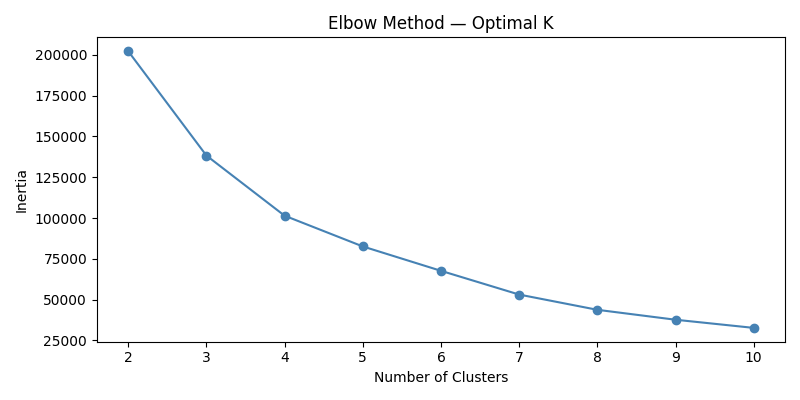
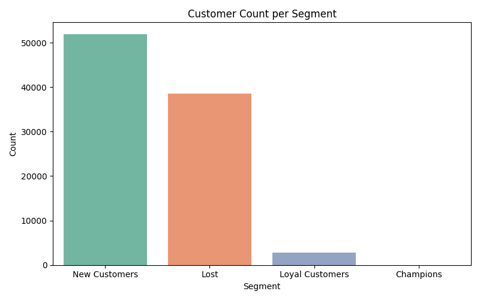
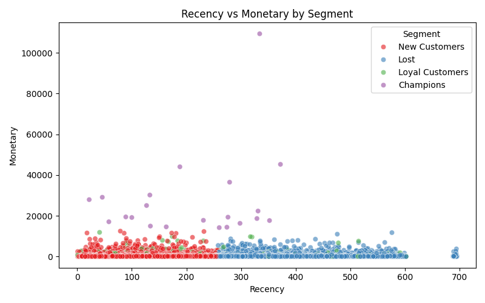
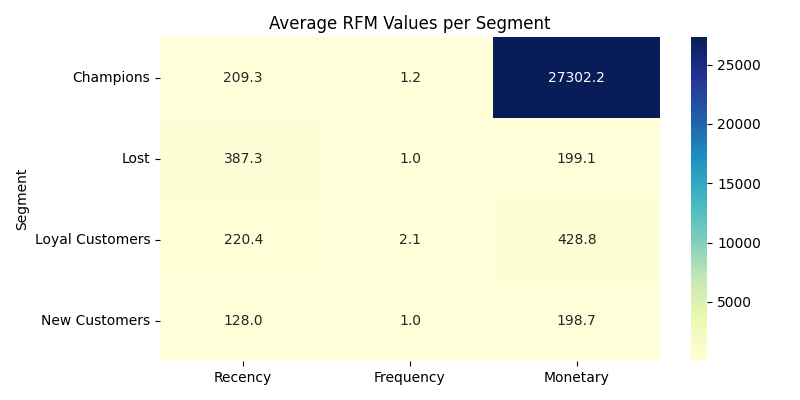

# 🛒 Customer Segmentation — Olist E-Commerce

## 📌 Business Problem
Olist wants to understand its customer base better.
By segmenting customers, marketing teams can target
the right customers with the right message.

## 📁 Dataset
Source: [Kaggle — Brazilian E-Commerce by Olist](https://www.kaggle.com/datasets/olistbr/brazilian-ecommerce)

| File | Description |
|------|-------------|
| olist_orders_dataset.csv | Order status and timestamps |
| olist_order_payments_dataset.csv | Payment values |
| olist_customers_dataset.csv | Customer info |
| olist_order_items_dataset.csv | Items per order |

## ⚙️ Methodology
1. Merged 4 tables into one master DataFrame
2. Filtered delivered orders only
3. Built RFM features per customer
4. Scaled features with StandardScaler
5. Used Elbow Method to find optimal K
6. Applied K-Means clustering (K=4)
7. Labeled segments based on RFM profiles

## 👥 Customer Segments

| Segment | Description |
|---------|-------------|
| Champions | High spend, frequent, recent buyers |
| Loyal Customers | Frequent buyers, good spend |
| At-Risk | Haven't bought in a while |
| New Customers | Bought recently but rarely |
| Lost | Long inactive, low spend |

## 📊 Visuals





## 🛠 Tools Used
- Python 3.12
- pandas, numpy
- matplotlib, seaborn
- scikit-learn (KMeans, StandardScaler)

## ▶️ How to Run
```bash
pip install pandas numpy matplotlib seaborn scikit-learn
python notebooks/customer_segmentation.py
```

## 👤 Author
**Rehan Ali** — Data Analyst
[GitHub](https://github.com/rehanalicreates)